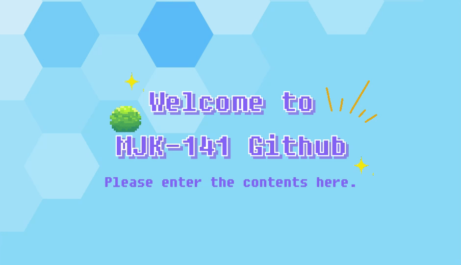

<div align="center">
  
  <h1>Hi there, I'm Jaeman Kim (김재만) 👋</h1>
  
  <p align="center">
    <a href="https://readme-typing-svg.demolab.com">
      
    </a>
  </p>

  <p align="center">
    <a href="https://www.linkedin.com/in/%EC%9E%AC%EB%A7%8C-%EA%B9%80-576ba7309" target="_blank">
      
    </a>
    <a href="mailto:kkhmo00@naver.com">
      
    </a>
    <a href="https://www.instagram.com/kjm6561/" target="_blank">
      
    </a>
    <a href="https://github.com/mjk-141">
      
    </a>
  </p>
</div>

<br/>

## 👨‍💻 About Me

현재 **AhnLab(안랩)**에서 **FinOps & Cloud Engineer**로 근무하고 있습니다.  
비즈니스 요구사항에 최적화된 **안정적인 클라우드 아키텍처 설계**와 데이터 기반의 **클라우드 비용 최적화(FinOps)**를 주도하며, 인프라 자동화와 거버넌스 체계를 구축하는 데 깊은 관심을 가지고 있습니다.

- 🏢 **Current**: **AhnLab (안랩)** FinOps & Cloud Engineer
- 💡 **Interests**: Cloud Cost Optimization, Cloud Architecture, IaC, CI/CD, Observability & Automation
- 🎓 **Education**: 가천대학교 컴퓨터공학과
- ✉️ **Contact**: [kkhmo00@naver.com](mailto:kkhmo00@naver.com)

<br/>

---

## 🛠️ Tech Stack & Skills

### ☁️ Cloud & FinOps
<p>
  
  
  
  
  
  
</p>

### ⚙️ DevOps & IaC & OS
<p>
  
  
  
  
  
  
  
</p>

### 💻 Languages & Scripting
<p>
  
  
  
  
</p>

### 🤝 Collaboration & Productivity
<p>
  
  
  
  
  
  
</p>

<br/>

---

## 💼 Career & Experience

```
🏢 AhnLab (안랩)               ─ FinOps & Cloud Engineer       [ 재직 중 ]
🏢 KT Skylife (KT 스카이라이프) ─ IT 운영팀 인턴                 [ 2025.04 ~ 2025.05 ]
🏢 (주) Hamalab (하마랩)        ─ DevOps팀 인턴                  [ 2024.03 ~ 2024.08 ]
```

### 🔹 **(주) 안랩 (AhnLab)**
- **🗓️ Period**: 재직 중
- **👔 Position**: **FinOps & Cloud Engineer**
- **📌 Key Focus**:
  - 클라우드 인프라 아키텍처 운영 및 리소스 관리
  - AWS 클라우드 비용 분석, 절감 기회 발굴 및 FinOps 프로세스 체계화
  - 클라우드 거버넌스 및 모니터링/자동화 파이프라인 구축

### 🔹 **KT 스카이라이프**
- **🗓️ Period**: 2025.04 ~ 2025.05
- **👔 Position**: 기술인프라본부 IT 운영팀 | 인턴
- **📌 Key Focus**:
  - IT 인프라 시스템 운영 지원 및 모니터링
  - 네트워크 및 시스템 환경 점검

### 🔹 **(주) Hamalab (하마랩)**
- **🗓️ Period**: 2024.03 ~ 2024.08
- **👔 Position**: DevOps팀 | 인턴
- **📌 Key Focus**:
  - AWS Cloud 환경 인프라 및 Linux 서버 구성/운영
  - CI/CD 파이프라인 구축 및 서비스 배포 자동화 실무 수행

<br/>

---

## 🏆 Certifications

| 자격증 명칭 | 발급 기관 | 취득 내용 |
| :--- | :--- | :--- |
| **AWS Certified Solutions Architect – Associate (SAA)** | Amazon Web Services | AWS 클라우드 아키텍처 설계 및 구축 역량 |
| **AWS Certified Cloud Practitioner (CCP)** | Amazon Web Services | AWS 클라우드 기본 개념 및 핵심 서비스 이해 |
| **SQL 개발자 (SQLD)** | 한국데이터산업진흥원 | 관계형 데이터베이스 및 SQL 데이터 모델링/쿼리 최적화 |
| **네트워크관리사 2급** | 한국정보통신자격협회 | NOS 및 네트워크 인프라 설계/운영 역량 |
| **정보처리기능사** | 한국산업인력공단 | IT 시스템 및 프로그래밍 기초 역량 |

<br/>

---

## 🙋 Activities & Education

### 💬 교내 활동
- **가천대학교 컴퓨터공학과 학술동아리 (Pay1oad)**
  - `2020.03 ~ 2022.12` | 정보보안 및 시스템 연구 학술 활동
- **가천대학교 중앙동아리 (가톨릭동아리)**
  - `2023.01 ~ 2023.08` | 동아리 회장 (조직 총괄 및 프로그램 기획/운영)
  - `2020.03 ~ 2020.09` | 동아리 부회장
  - `2019.04 ~ 2019.12` & `2022.07 ~ 2022.12` | 일반 회원 활동

### 💬 대외활동 및 교육
- **사피엔스4.0 대학생 IT 교육 서포터즈 6기 (KB 금융 IT 교육 봉사)**
  - `2023.04 ~ 2023.08` | 청소년 대상 IT/SW 교육 멘토링 및 봉사 활동
- **AWS Academy (AWS 공식 아카데미)**
  - `2023.09 ~ 2023.12` | Cloud Foundations & Cloud Architecting 과정 수료

<br/>

---

## 📊 GitHub Stats

<div align="center">
  
  &nbsp;
  
</div>

<br/>

<div align="center">
  <sub>Designed with ❤️ by Jaeman Kim</sub>
</div>
